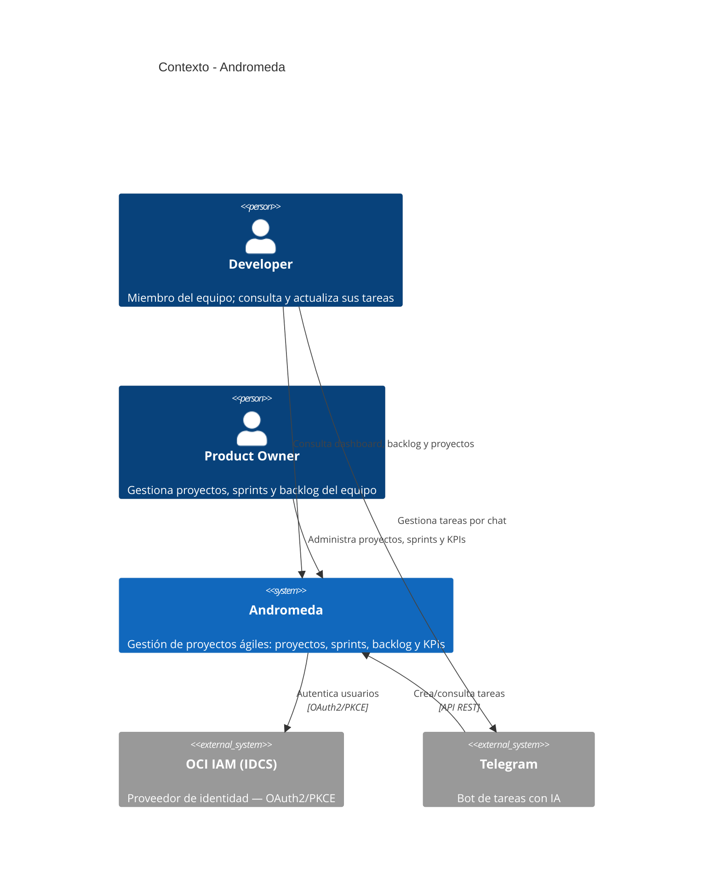
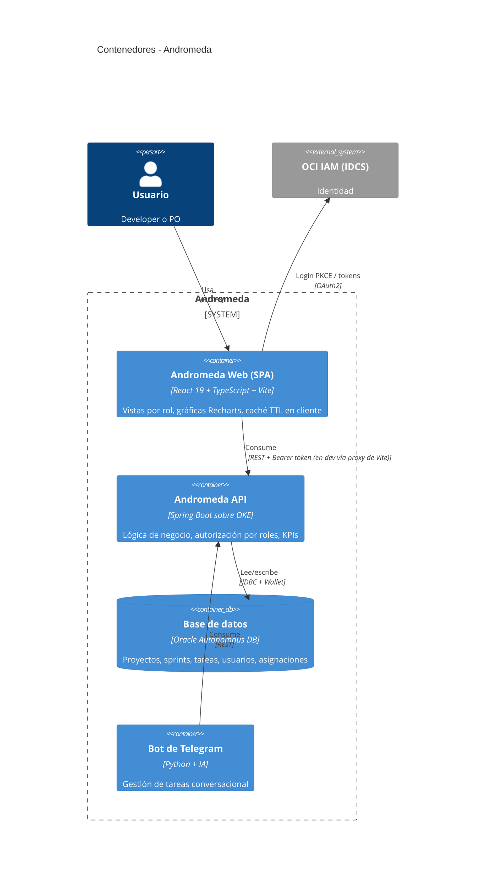
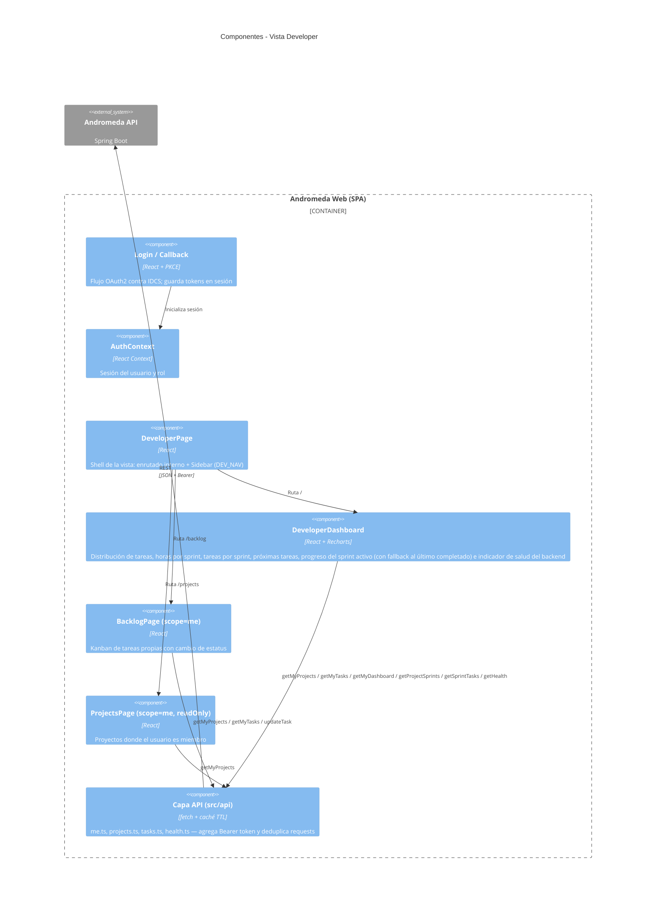

# Arquitectura C4 — Andromeda

> **Autores:** JaviSan, Paco · Niveles 1–2 cubren el sistema completo (compartidos entre branches). Nivel 3 documenta los componentes de la **vista Developer**; la vista PO agrega su propio nivel 3 en `docs/po/`.

## Nivel 1 — Contexto del sistema

## Nivel 2 — Contenedores

**Despliegue:** la API y el frontend se contenerizan (Docker), se publican en Oracle Container Registry y corren en un clúster **OKE**; CI/CD con GitHub Actions. El frontend en desarrollo corre con Vite en `https://localhost:5173` y proxea `/api` y `/health` al backend desplegado.

## Nivel 3 — Componentes de la vista Developer (SPA)

### Endpoints consumidos por la vista Developer

| Endpoint | Uso |
|---|---|
| `GET /health` | Indicador compacto de disponibilidad del backend |
| `GET /api/me/projects` | Proyectos donde el usuario autenticado es miembro |
| `GET /api/me/tasks` | Tareas asignadas al usuario (todas sus iniciativas) |
| `GET /api/me/dashboard?projectId=` | KPIs personales por proyecto: `myTaskDistribution`, `myHoursPerSprint`, `myTasksPerSprint` |
| `GET /api/projects/{id}/sprints` | Sprints del proyecto — la card de progreso usa el sprint `active` o, como fallback, el último `completed` |
| `GET /api/projects/{id}/sprints/{sid}/tasks` | Tareas del sprint para calcular el % de avance del equipo |
| `PATCH /api/projects/{id}/tasks/{taskId}` | Cambio de estatus de una tarea desde el backlog |

### Decisiones de diseño relevantes

- **Alcance "me":** toda la vista Developer consume endpoints `/api/me/*`; las tareas cuyo proyecto no aparece en la membresía del usuario se descartan en el cliente (asignaciones huérfanas en BD).
- **Caché TTL en cliente** (`src/lib/cache.ts`): deduplica llamadas repetidas entre dashboard y backlog dentro de la misma sesión.
- **Estatus `revision`:** el backend no lo soporta; se mapea a `in_progress` en el wire y se persiste localmente en `sessionStorage`.
- **Componentes compartidos con PO** (`BacklogPage`, `ProjectsPage`, `Sidebar`): se parametrizan con `scope`/listas de navegación por rol en lugar de duplicarse; los cambios de esta branch no alteran el comportamiento de PO.

## Nivel 3 — Componentes de la vista PO

_Pendiente — se documenta en la branch del PO (`docs/po/`)._
